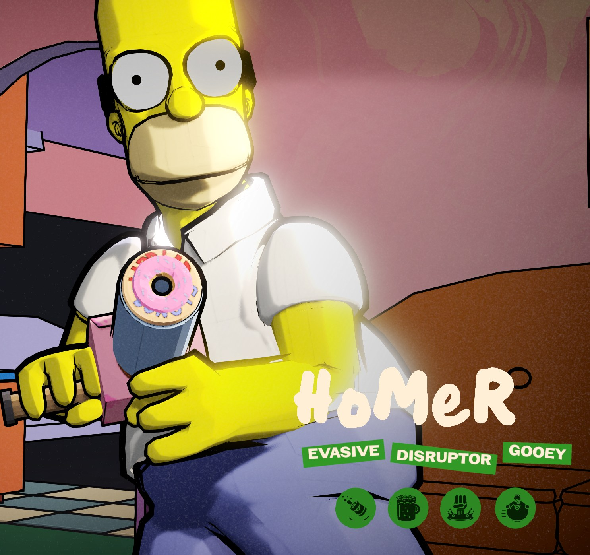
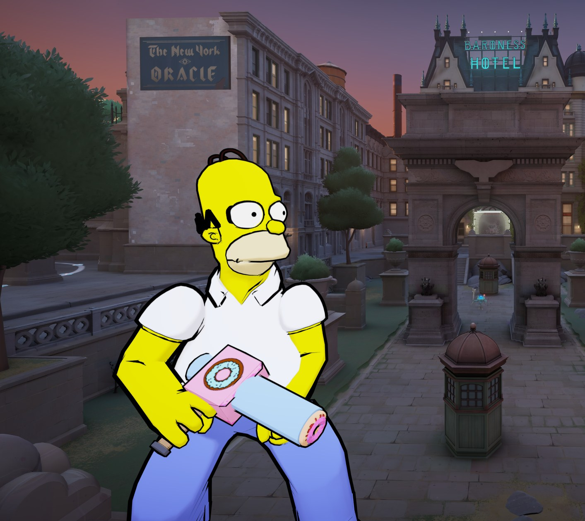
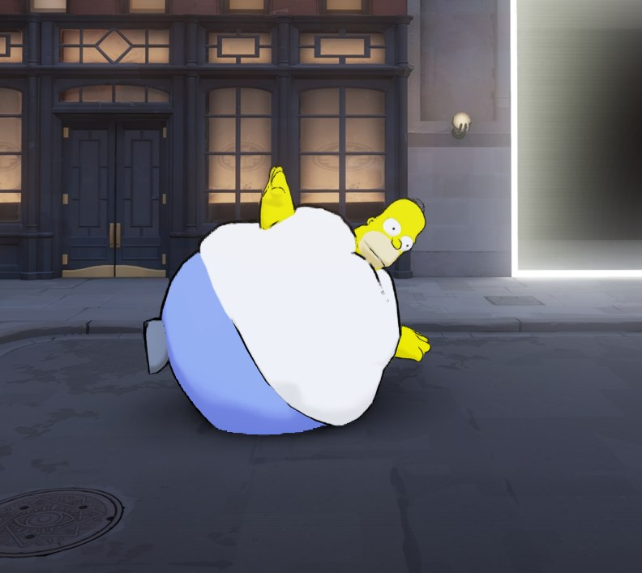
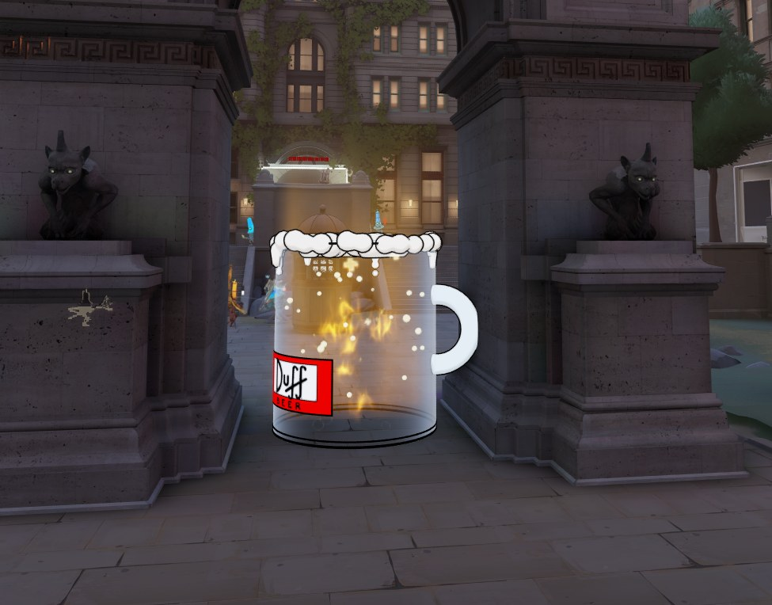

# Homer-Viscous

Homer Simpson from *The Simpsons Game* (2007), replacing Viscous in [Deadlock](https://store.steampowered.com/app/1422450/Deadlock/).



## Features

- Homer's model from *The Simpsons Game*, rigged to Viscous, with a cel-shaded toon look and ink outlines
- The Lard Lad Donut Bazooka: alt-fire launches a real donut
- Every ability re-themed, with sound effects from *The Simpsons Game*
- Over 350 Homer voice lines from the game (hero-specific pings keep Viscous's voice so callouts stay clear)
- Custom hero-select scene in the Simpsons' living room, with hero cards and icons



### Abilities

| Viscous ability | Homer theme |
|---|---|
| Splatter | Duff Can |
| The Cube | Duff Mug |
| Puddle Punch | Beer Punch |
| Goo Ball | Homer Ball |


 


## Install

1. Download `pak03_dir.vpk` from the [latest release](../../releases/latest).
2. Open `Deadlock\game\citadel\gameinfo.gi` and add this line inside `SearchPaths`, above `Game citadel`:
   ```
   Game                citadel/addons
   ```
3. Put the VPK in `Deadlock\game\citadel\addons\`. Create the folder if it doesn't exist.
4. Launch the game and pick Viscous.

Game updates can reset `gameinfo.gi`. If the mod stops loading, add the line again.

## Known issues

- When Homer uses Duff Mug on himself, he isn't visible inside it. The game hides the caster during a self-cube, the same as stock Viscous.
- Homer Ball's arms don't flop like Viscous's.

## Credits

Homer Simpson and *The Simpsons* belong to 20th Television and Disney. The model, props, sounds and voice lines (Dan Castellaneta) come from *The Simpsons Game* by Electronic Arts. Deadlock belongs to Valve. This is a free fan mod and isn't affiliated with any of them.
